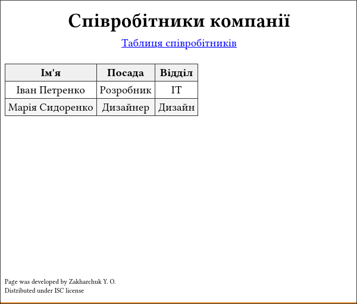

# Хід роботи

1. Скопіюйте HTML в новий файл
2. Напишіть CSS в тегу &lt;style&gt; або в зовнішньому файлі
3. Відкрийте файл у браузері і перевірте результат
4. Експериментуйте — змінюйте селектори, додавайте властивості,
   дивіться, що змінюється

## Варіант 16: Таблиця посадовців

**Опис:** Таблиця з інформацією про працівників компанії.

**Ваше завдання:**
- Таблиця повинна мати рамку 1px (#333) на всіх сторонах
- Заголовки (thead) — чорний шрифт та світло-сіру фон (#f0f0f0) 
- Перший стовпець (ім’я) повинен мати жирний шрифт 
- Парні рядки повинні мати фон #f5f5f5 (для легкості читання)

## Лістинг:

### index.html:

```html {.include-as-code-block}
index.html
```

### style.css:

```css {.include-as-code-block}
style.css
```

## Результати тестування:



# Контрольні запитання

1. Назвіть три способи підключення CSS до HTML та їх переваги/недоліки.

   1 Додавати стилі напряму до компонентів:
   ```html
   <p style="css style"></p>
   ```
   - Переваги: швидко, очевидний зв'язок
   - Недоліки: працює тільки для одного компоненту, не можна стилізувати все одночасно
   
   2 Додати &lt;style&gt; тег у head і писати css там:
   ```html
   <style>
   p {
       font-size: 14pt;
   }
   ```
   - Переваги: розділяє css та html, не збільшується кількість файлів
   - Недоліки: обмежено однією сторінкою, незручно якщо занадто багато стилю, не кешується

   3 Створити окремий css файл і приєднати до сторінки 
   ```html
   <link rel="stylesheet" href="style.css"/>
   ```
   - Переваги: Чітке розділення, гарно кешується, може бути перевикористаний для декількох сторінок
   - Недоліки: При необережному використанні може привести до спагетті коду
   

2. Що таке селектор елементу? Надайте приклади та напишіть CSS
   правило для стилювання всіх абзаців.

   Селектор елементу дозволяє задати стиль всім елементам однакового тегу.  
   Приклад: `p { color: #333; }`

3. Як правильно іменувати класи в CSS? Чому не варто називати класи за їх виглядом?

   Класи використовуються для стилювання семантично близьких елементів однаково.
   Не варто називати класи за потрібним виглядом (наприклад blue-text).

4. На чому полягає різниця між класом та ID? Коли використовувати кожен?

   Один клас може об'єднувати декілька елементів і за ним їм можна надати один стиль,
   ID повинен бути унікальним (у стилі може використовуватись для точкового стилювання).

5. Напишіть CSS для групування селекторів, який застосує синій
   колір до заголовків h1, h2, h3.

   ```css
   h1, h2, h3 {
       color: blue; 
   }
   ```

6. Що робить універсальний селектор (*)? Де його типово використовують?

   `*` - селектор всіх елементів.
   Типово використовується для скидання браузерних стилів на початку CSS.

7. Напишіть селектор, який вибирає всі посилання всередину
   елемента з ID "navigation".

   ```css 
   #navigation a
   ```

8. Що таке селектор дочірнього елементу (&gt;) та чим він відрізняється
   від селектора нащадка?

   Дочірній елемент (&gt;) вибирає тільки прямих нащадків,  
   селектор нащадка (пробіл) вибирає нащадків на будь-якій глибені.

9. Напишіть селектор, який вибирає лише перший абзац одразу після
   кожного заголовка h2.

   - Відповідь: h2 + p

10. Назвіть специфічність таких селекторів і розмістіть їх у порядку
    зростання специфічності:

    1. селектор всіх елементів (`*`);
    2. селектор елементу за тегом;
    3. селектор дочірнього тегу;
    4. селектор класу;
    5. селектор id;
    6. inline стиль.

11. Як структурувати проект з HTML та CSS файлами? Опишіть
    типову організацію папок.

    HTML та CSS розділяються.  
    Типова структура: static/styles.css, static/index.html, static/*.html

12. Напишіть CSS правило, яке встановить для всіх текстових полів
    (input[type="text"]) border 1px solid #ddd.

    ```css
    (input[type="text"]) {
        border 1px solid #ddd;
    }
    ```

13. Що означає "наслідування" в CSS? Наведіть приклад властивості,
    яка наслідується, та властивості, яка не наслідується.

    Наслідування у CSS — передача властивості від батька до дитини.  
    Наслідується: color, font-size. Не наслідується: border, margin.

14. Напишіть селектор, який вибирає всі елементи li в
    упорядкованому списку (ol) всередину елемента з класом "navigation".

    ```css
    .navigation ol li {
        ...
    }
    ```

15. Виправіть помилку в селекторі. Що не так?
    ```css
    div > p span {
        color: blue;
    }
    ```

    Селектор означає: "всі span всередину p, які є прямими дочерками div". 

    Якщо на увазі малося всі прямі нашадки div що є p та span, потрібно написати:
    ```css
    div > p, div > span {
        color: blue;
    }
    ```
