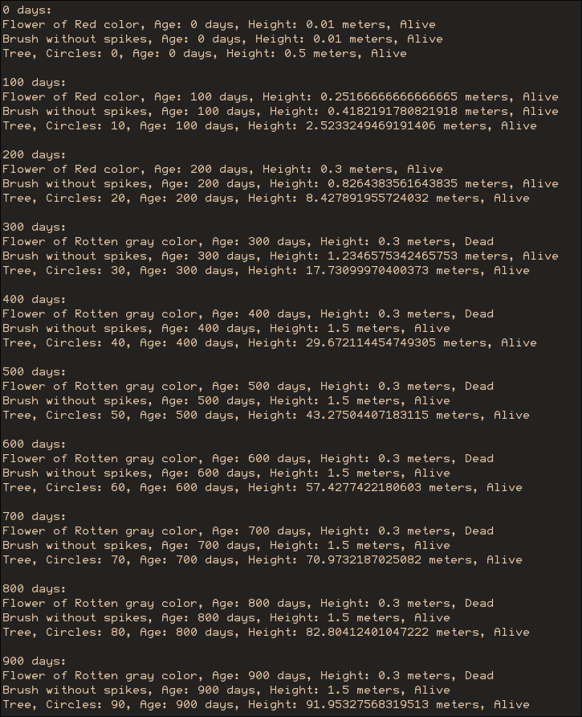
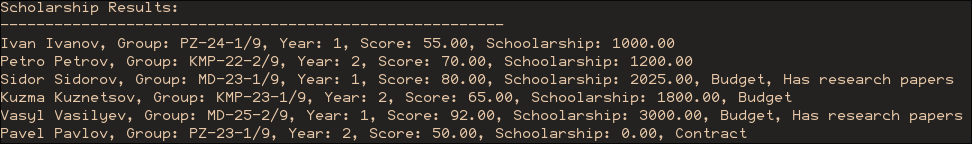

# Хід роботи

1 Для здобуття мінімально необхідного похідного балу за виконання
лабораторної роботи з таблиці 1 обрати завдання до виконання. Номер варіанту
за списком для кожної підгрупи.

: Індивідуальне завдання

--------------------------------------------------------------------------------
Варіант Завдання
------- ------------------------------------------------------------------------
16      Ієрархія має містити класи: "Рослина", "Квітка", "Кущ" та
        "Дерево". Класи мусять мати поля та методи, що описують різні типи
        рослин, як живі істоти, що мають певні морфологічні особливості та
        належать до певного виду. Класи мусять мати всі необхідні
        конструктори, set- та get-методи, та метод, що відбиває зростання
        конкретної рослини (інформацію про зростання треба друкувати на екрані).
--------------------------------------------------------------------------------

2 Для здобуття більш високого балу за виконання лабораторної роботи виконати 
додатково одне завдання (рівень 1) або два завдання (рівень 2) з таблиці 2.

: Ускладнене завдання

+---------+------------------------------------------------------------------------+
| Варіант | Завдання                                                               |
+=========+========================================================================+
| 16      | Створіть клас Student ,що містить поля Прізвище, Ім’я, Група,          |
|         | Рік навчання, Мінімальний розмір стипендії, Рейтинговий бал. Від       |
|         | класу Student створити ієрархію успадкування– Бакалавр, Магістр,       |
|         | Аспірант. В класах Магістр та Аспірант передбачити поля Наявність      |
|         | наукових робіт та Наявність бюджетного місця.                          |
|         | Створити метод getScholarship() для класу Student, який                |
|         | повертає суму стипендії. Розрахунок суми стипендії залежить від        |
|         | Рейтингового балу, а саме:                                             |
|         |                                                                        |
|         | - 0 – 60:          мінімальний                                         |
|         | - 61 – 74:         мінімальний * 0,2                                   |
|         | - 75 – 89:         мінімальний * 0,35                                  |
|         | - 90 – 100:        мінімальний * 0,5                                   |
|         |                                                                        |
|         | Передбачити для класів Бакалавр, Магістр, Аспірант різний              |
|         | мінімальний розмір стипендії. Для класів Магістр та Аспірант           |
|         | підвищити рейтинговий бал на 10% при наявності наукових робіт.         |
|         | Створити масив типу Student, що містить об'єкти класів                 |
|         | Бакалавр, Магістр та Aspirant. Викликати метод getScholarship() для    |
|         | кожного елемента масиву. Вивести результати.                           |
+---------+------------------------------------------------------------------------+

3 Створити та надати викладачеві звіт з виконання лабораторної роботи.
Звіт повинен містити тему, мету та обладнання для виконання лабораторної
роботи, короткий опис постанови задачи для кожного з завдань, лістинг
програми, скріншоти результатів тестування програми.

## Лістинг:

### Перше завдання:

```java {.include-as-code-block}
Task1.java
```

### Друге завдання:

```java {.include-as-code-block}
Task2.java
```

## Результати тестування:





# Контрольні запитання

1. Яким чином у різних мовах програмування поділяють характер
   взаємних відносин між суперкласом та підкласом успадкування.

   У C# та Java доступно тільки одиночне успадкування, але можлива реалізація набору інтерфейсів

   У таких мовах, як C++ та Python множинне успадкування можливе, і немає чіткої межі між абстрактним класом та інтерфейсом.

2. Розкрийте зміст властивості, яка отримала назву "пошук реалізації".

   Пошук реалізації — пошук середовищем виконання правильного методу для виклику
   із урахуванням поліморфізму.  
   Пошук починається із класу об'єкту і, якщо він містить метод, береться найнижче в
   ієрархії його перевизначення. Інакше пошук продовжується у класі вище по ієрархії.

3. Яким чином можна заблокувати успадкування для окремих класів та
   при перевизначенні окремих методів.

   Ключове слово final робить клас чи його окреме поле недоступним для перевизначення

4. У якому випадку члени класу належать самому суперкласові та не
   беруть участі в механізмі успадкування.
   
   Якщо вони оголошені як private та/або static

5. Яку особливість має успадкування статичних членів класу.

   Статичні поля спільні для всієї ієрархії, при перевизначені не будуть динамічно 
   зв'язуватися.

6. Чи може міститися абстрактний метод у звичайному (не абстрактному) класі?
   
   Якщо клас не визначено як abstract він усе одно може мати абстрактні методи

7. Яким чином включаються члени суперкласу до підкласу, якщо вони
   визначені за умовчанням, чи можна до них звертатися просто на ім'я?
   
   За завмовчанням поля є friendly, що означає що вони будуть успадковуватися
   із доступом із підкласу у межах пакету.

8. Яким чином включаються члени суперкласу до підкласу, якщо вони
   визначені як приватні?
   
   Вони будуть присутні у пам'яті, але не доступні із коду того класу, що
   їх успадкував

9. Як створюється об'єкт підкласу, якщо конструктори оголошені як у
   підкласі, так і у суперкласі?
   
   Спочатку викликається конструктор суперкласу (без параметрів якщо не 
   викликано явно), вже після - підкласу.

10. До якого рівня ієрархії відбувається звернення у конструкторі підкласу,
    якщо в ньому є виклик конструктора super()?
    
    Виклик super() завжди викликає безпосереднього попередника даного класу
